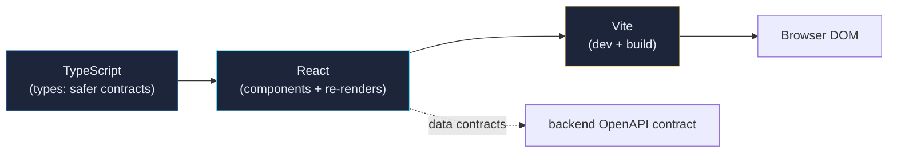
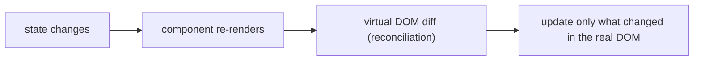
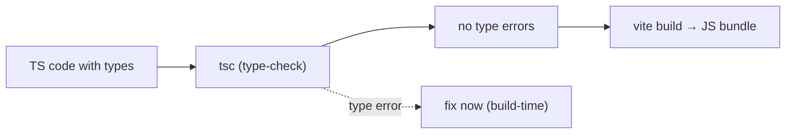
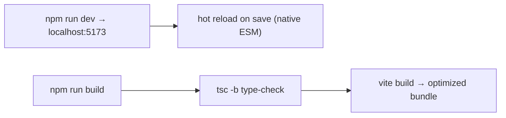

# StockForge — Frontend Cheat Sheet (React · TypeScript · Vite)

> One-page reference for the trading UI stack: what **React**, **TypeScript**, and **Vite** each do,
> the key findings that matter, and a **Frontend Debugging Lab** (plant bugs → hunt them) we will run
> later — the frontend twin of the backend JFR lab.
>
> This is the **combined cheat sheet** — canonical copy lives in this repo
> (`project-context/cheatsheets/frontend-cheat-sheet.md`); the Obsidian vault mirrors it at
> `TechStack/Frontend Cheat Sheet.md`. Mermaid diagrams render natively in both Obsidian and GitHub.
>
> Repo: `stockforge-web` (Day 4). HTML review: `reviews/day-0-6-concept-review.html` (Day 4 section).

---

## 0. Key findings (understand now)

- **React = UI from components, and the app re-renders when state changes.** The mental model is
  "describe the screen as a function of state", not "manipulate the DOM by hand".
- **A re-render is not free.** When a component re-renders, its children usually do too — so the
  frontend cost source is *unnecessary re-renders* (the mirror of backend *lock contention*: work that
  shouldn't happen blocks progress).
- **TypeScript = JavaScript with types.** The compiler (build-time, `tsc -b`) catches the mistakes that
  would otherwise surface at runtime. It makes the frontend's data contracts safer — the same idea as
  our contract-first OpenAPI.
- **Vite = the fast dev server + build tool.** Native ESM for instant hot reload in dev; one command
  (`vite build`) produces the optimized production bundle.
- **"The pretty screen is not the platform."** The UI is a *consumer* of the backend. Speed and
  correctness live in the matching/risk/auth services — in HFT the UI isn't even on the hot path.
- **PowerShell gotcha:** use `npm.cmd` (PowerShell blocks `npm` via its script policy).

## 1. The stack in one picture

| Layer | Job | "If it's gone" |
|---|---|---|
| **React** | Build the screen from components; re-render on state change | Hand-DOM manipulation, unmaintainable |
| **TypeScript** | Types so errors are caught at build, not runtime | Silent type bugs, fragile data |
| **Vite** | Fast dev server (HMR) + production build | Slow dev/build loop |

## 2. React — the concept

- **Components** = functions returning a description of the screen (`App.tsx` is the root; `main.tsx`
  mounts React into `
`).
- **State + props** = the data that drives rendering; when they change, the component re-renders.
- **The cost source:** a parent re-render can re-render many children, even ones whose data didn't
  change. That's the frontend's version of *contention* — wasted work on the path to the screen.

> **Finding to remember:** the frontend performance question is "what re-renders, and why?" — the
> mirror of the backend "which thread waits, and why?"

## 3. TypeScript — the concept

- Types turn "works in my head" into "proven by the compiler". `npm run build` runs `tsc -b` first, so
  a wrong shape fails the build before it ever reaches the browser.
- Same philosophy as contract-first: our `openapi.yaml` pins the backend contract; TypeScript pins the
  frontend data shapes. Later we can generate TS types **from** the OpenAPI contract so both sides can
  never drift.

## 4. Vite — the concept

- Dev = instant feedback loop. Build = `tsc -b && vite build` (type-check then bundle).
- **Frontend bundle size matters:** the browser must download/parse the JS before the screen is
  interactive — the mirror of backend *GC/memory*: unneeded weight = slower start.

## 5. The three pillars (frontend edition) — how they map to the backend

| Backend pillar | Frontend mirror | The question to ask |
|---|---|---|
| **GC** (memory) | **Bundle size / heavy rendering** | What weight does the browser pay before/while the screen works? |
| **Lock contention** (threads waiting) | **Unnecessary re-renders** | What re-renders that doesn't need to, and why? |
| **JFR** (visibility) | **React DevTools Profiler / browser DevTools** | Which tool shows me where the time/renders actually go? |

> Same mindset, different tools: *measure before optimizing*, and every change =
> baseline → hypothesis → change → measure → conclude.

## 6. Frontend Debugging Lab (plant bugs, then hunt them — later)

Once the web app is wired to the real API, we run the same exercise as the backend lab — on our own UI:

| # | Plant | Hunt with | What it teaches |
|---|---|---|---|
| 1 | Baseline render times on the dashboard (before touching anything) | React DevTools Profiler | The numbers to compare against |
| 2 | A state update that re-renders a big subtree on every tick | Profiler "why did this render?" | Reconciliation cost; memoization targets |
| 3 | Inline object/function props breaking memo (components re-rendering anyway) | Profiler + components list | Stable references / hooks dependencies |
| 4 | A heavy synchronous task on the main thread (blocks UI) | Performance tab / Lighthouse | "jank" = the frontend's latency spike |
| 5 | Unneeded bundle weight (large import) | `vite build` chunk output / Lighthouse | Parsing/download cost → slower interactivity |
| 6 | Fix each, re-profile, compare | Profiler again | Proof the findings work |

**Tools:** React DevTools Profiler (the frontend "JFR") · browser Performance tab · Lighthouse ·
`vite build` chunk-size report · oxlint (`npm run lint`) for static catches.

> **Why plant bugs on purpose?** Same reason as the backend: when you create the problem, you learn
> exactly which profiler flame chart or render bar reveals it. By the time we meet a *real* UI
> performance issue, the workflow is muscle memory.

## Related docs

- `project-context/cheatsheets/jvm-performance-cheat-sheet.md` — backend twin (GC / JFR / locks)
- `project-context/reviews/day-0-6-concept-review.html` — Day 4 web section
- `LEARNING_LOG.md` — Day 4 entry
- Vault: `TechStack/React Vite TypeScript`, `TechStack/Frontend Cheat Sheet`, `Repos/stockforge-web`
