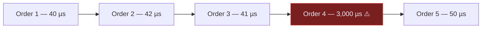
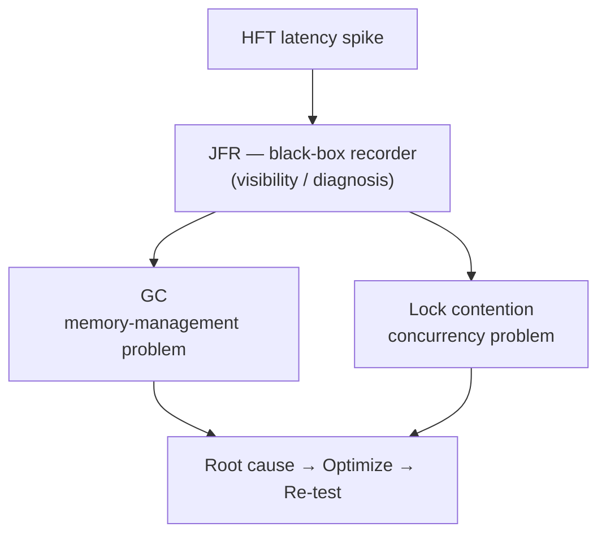
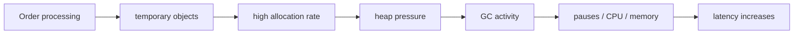
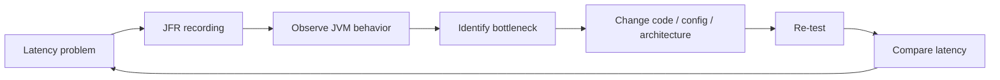
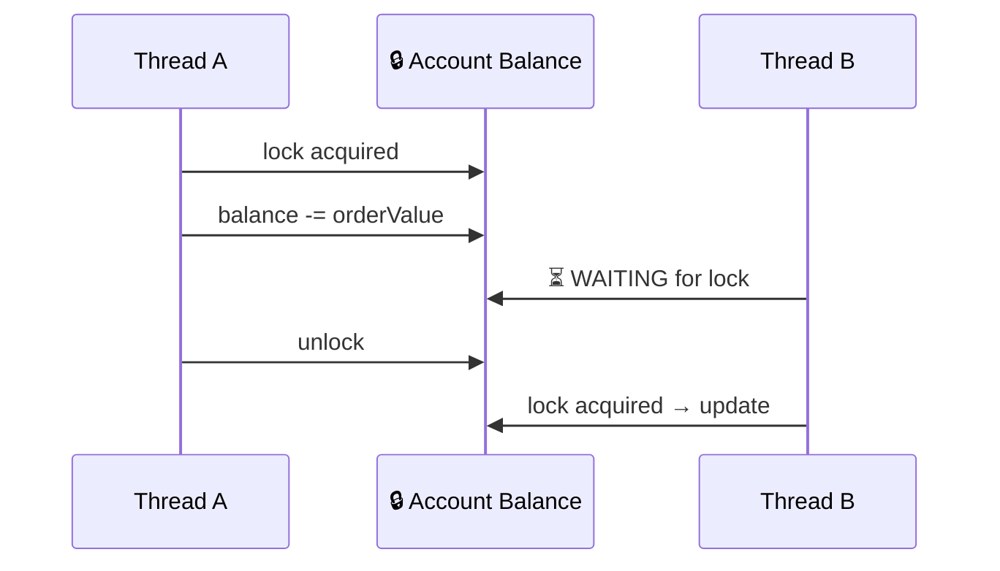
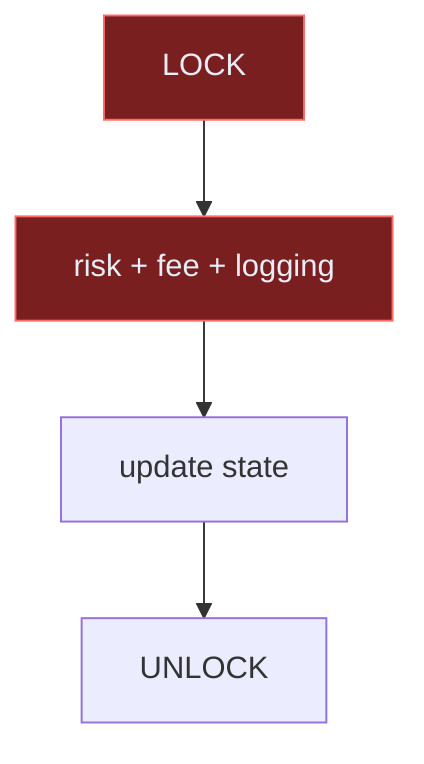
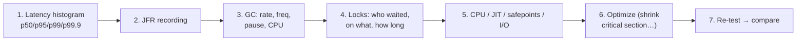

# StockForge — JVM Performance Cheat Sheet (combined)

> One-page visual reference for HFT latency investigation: **GC**, **JFR**, **lock contention** — and
> the **Core Trading Stack decision** they drove.
>
> This is the **combined cheat sheet** — the canonical copy lives in this repo
> (`project-context/cheatsheets/jvm-performance-cheat-sheet.md`); the Obsidian vault mirrors it at
> `TechStack/JVM Performance Cheat Sheet.md`. Mermaid diagrams render natively in both Obsidian and
> GitHub. An offline HTML version also exists: `project-context/cheatsheets/hft-performance-cheat-sheet.html`.
>
> Study source: `LEARNING_LOG.md` bonus entry (2026-08-10) · ADR `0003-core-trading-stack.md`.

---

## 0. Key findings (the take-aways, 2026-08-10)

- **GC is not bad** — the problem is *uncontrolled allocation and GC behavior causing unpredictable
  latency and tail-latency spikes* (a 40 µs order randomly becomes 3,000 µs). Modern collectors (G1,
  ZGC, Shenandoah) do most work concurrently.
- **JFR = the JVM's black-box recorder.** It records GC, allocation, CPU, threads, lock contention, JIT,
  safepoints, I/O. It does **NOT fix anything** — it tells you *where to look*: record → observe → find
  bottleneck → change → re-test → compare.
- **Lock contention = threads waiting for a shared lock.** One thread waiting 1 ms on a 50 µs order path
  ≈ 1,050 µs total → jitter at p99/p99.9. Mindset: *"threads waiting for shared resources create
  unpredictable latency"* — not "locks are slow".
- **Reduce contention:** shrink the critical section (risk/fee/logging OUTSIDE the lock), shard state,
  single-writer, message passing, atomics, lock-free structures, less shared mutable state.
- **Spring Boot does NOT manage GC/threads/JIT/locks — the JVM does.** Spring Boot = the **control plane**
  (REST, admin, config, monitoring, reporting); the hot trading path should not drag Boot/DB/Kafka along.
- **Core Trading Stack decision (ADR 0003, PROPOSED):** first core-trading implementation in **plain
  Java** (market data → trading engine → strategy → risk → OMS → exchange gateway) to *deeply learn JVM
  performance engineering*. This is NOT a claim Java > C++ — a C++ equivalent is a later comparison
  target (latency, GC vs manual memory, CPU, locking, networking, p99.99).
- **Next practical step:** JFR practical lab — small plain-Java app, controlled allocation/contention
  problem, record with JFR, inspect GC/CPU/lock behavior.

---

## 1. The whole problem in one picture



> The average looks fine. **p99 / p99.9 does not.** One spike among thousands = a tail-latency problem.
> HFT perf engineering = finding and removing the spikes.

## 2. The three pillars



| Pillar | Type of problem | The question |
|---|---|---|
| **GC** | Memory | Uncontrolled allocation → unpredictable pauses → spikes |
| **Lock contention** | Concurrency | Threads waiting on a shared lock → jitter at p99/p99.9 |
| **JFR** | Visibility | Tells you *where to look* (does NOT fix anything) |

## 3. GC — the concept



> **GC is not bad.** The problem is *uncontrolled allocation and GC behavior → unpredictable latency
> and tail-latency spikes*. Modern collectors (G1, ZGC, Shenandoah) do much work concurrently.

**Investigate:** allocation rate · GC frequency · which GC · pause length · GC CPU · p99/p99.9 effect.

## 4. JFR — the workflow



**JFR sees:** GC · allocation · CPU · threads · **lock contention** · exceptions · safepoints · JIT ·
class loading · I/O · JVM pauses.

## 5. Locks & contention



> Normal = 50 µs. Lock wait = 1,000 µs. Total ≈ 1,050 µs → latency jitter + tail-latency spikes.
> **Don't think "locks are slow" — think "threads waiting for shared resources create unpredictable
> latency."**

### Reducing contention — the ladder



**Bad:** expensive work inside the lock. **Better:** only the state change inside the lock; risk/fee/logging outside.

| Approach | Idea |
|---|---|
| Shrink critical section | Only the state change under the lock |
| Partition / shard | One hot map → N maps (e.g. per-symbol) |
| Single-writer | One thread owns mutation |
| Message passing | Threads exchange immutable messages |
| Atomics | `AtomicInteger` / `LongAdder` |
| Lock-free structures | Concurrent collections |
| Less shared mutable state | Thread-local / immutable |

## 6. Spring Boot vs the hot path

```mermaid
flowchart LR
    subgraph Control["CONTROL PLANE — Spring Boot"]
        REST["REST APIs"] Admin["Admin"] Config["Config"] Mon["Monitoring"] Report["Reporting"]
    end
    subgraph Core["HOT PATH — plain Java (ADR 0003)"]
        MD["Market Data"] Engine["Trading Engine"] Strat["Strategy"] Risk["Risk"] OMS["Order Mgmt"] GW["Exchange Gateway"]
    end
    Control -. feeds/monitors .-> Core
```

> **Spring Boot does NOT manage GC / threads / JIT / locks — the JVM does.** Spring Boot = control plane;
> the latency-critical path is built in **plain Java**, and a **C++ equivalent** is a later comparison
> target (latency, GC vs manual memory, CPU, locking, networking, p99.99).

## 7. Investigate-a-spike checklist



> Every change = baseline → hypothesis → change → measure → conclude (PROJECT_CONTEXT §17).

## 8. Next step — JFR practical lab

> Small **plain-Java** app → controlled allocation + hot-lock problem → record with **JFR** → inspect →
> see GC/CPU/lock behavior with our own eyes. Tracked as a side quest in the vault.

## Related docs

- `project-context/LEARNING_LOG.md` — bonus deep-dive entry (2026-08-10)
- `project-context/adr/0003-core-trading-stack.md` — Core Trading Stack decision (`PROPOSED`)
- `project-context/cheatsheets/hft-performance-cheat-sheet.html` — offline HTML version
- `PROJECT_CONTEXT.md` §17 — HFT Evolution / hot-path split
- Vault: `TechStack/GC`, `TechStack/JFR`, `TechStack/Lock Contention`, `TechStack/Core Trading Stack`,
  `ADRs/ADR 0003 - Core Trading Stack`, `Journal/Teach-back - JVM performance engineering`
